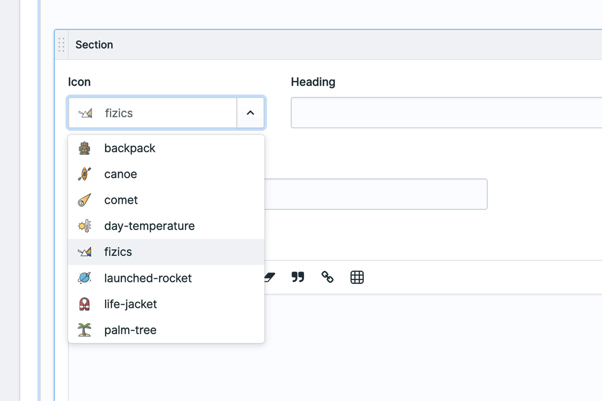

# Iconamic

<!-- statamic:hide -->

---

<!-- /statamic:hide -->

> Iconamic is an SVG icon picker fieldtype and tag for Statamic 3 and Statamic 4

## Features

Iconamic allows you to have a folder of SVG icons in your site (or even an Asset container if you want your authors to
be able to upload them too) and provides you with a fieldtype to pick an icon from your list with a neat little preview
of your SVG too.

In your Antlers template, use the Iconamic tag to check if an icon exists (in case you have extra markup to include or
exclude), and inject the SVG contents in to your page markup.

This addon features:

- Iconamic fieldtype for icon selection
- Iconamic tag to inject an SVG icon in to your markup using Antlers (Regex or Runtime)
- Can be used in your Blueprints, including in Bard Sets and even within a Replicator
- Configure a path and path helper for all fieldtypes to use by default
- Override a specific instance to use a different path and/or path helper
- Performs some minor tweaks to your SVG to prevent duplicate IDs being output

## Documentation

See the [documentation](https://docs.mity.com.au/iconamic) for detailed installation, configuration and usage
instructions.

## Support

We love to share work like this, and help the community. However it does take time, effort and work.

The best thing you can do is [log an issue](../../issues).

Please try to be detailed when logging an issue, including a clear description of the problem, steps to reproduce the
issue, and any steps you may have tried or taken to overcome the issue too. This is an awesome first step to helping us
help you. So be awesome - it'll feel fantastic.

## Credits

- [Marty Friedel](https://github.com/martyf)

## License

The MIT License (MIT). Please see [License File](LICENSE.md) for more information.
