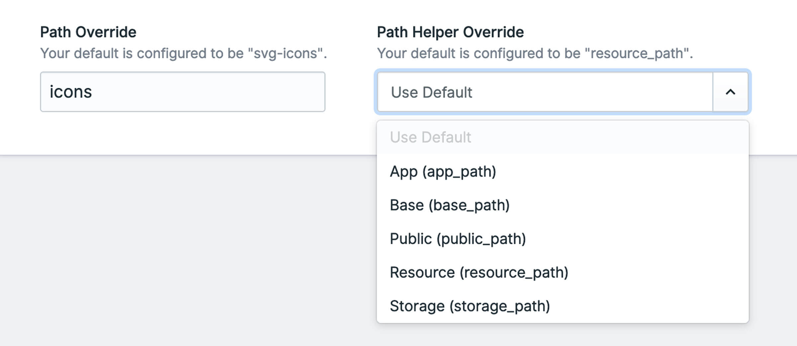

# Iconamic

<!-- statamic:hide -->


[](https://packagist.org/packages/mitydigital/iconamic/stats)

---

<!-- /statamic:hide -->

> Iconamic is an SVG icon picker fieldtype and tag for Statamic 3.


## Features

Iconamic allows you to have a folder of SVG icons in your site (or even an Asset container if you want your authors to
be able to upload them too) and provides you with a fieldtype to pick an icon from your list with a neat little preview
of your SVG too.

In your Antlers template, use the Iconamic tag to check if an icon exists (in case you have extra markup to include or
exclude), and inject the SVG contents in to your page markup.

This addon features:

- Iconamic fieldtype for icon selection
- Iconamic tag to inject an SVG icon in to your markup using Antlers (Regex or Runtime)
- Can be used in your Blueprints, including in Bard Sets and even within a Replicator
- Configure a path and path helper for all fieldtypes to use by default
- Override a specific instance to use a different path and/or path helper
- Performs some minor tweaks to your SVG to prevent duplicate IDs being output

## How to Install

Require using Composer:

``` bash
composer require mitydigital/iconamic
```

Publish the config file:

``` bash
php artisan vendor:publish --tag=iconamic-config
```

This will create the `config/statamic/iconamic.php` config file.

### Configuration

There are two config options:

You can set two defaults to customise where your SVG icons live in your project. By default, the config will look
in `resources/icons`. You can set a `path` and a `path_helper`.

1. `path` to provide a default path to your SVG icons from one of Laravel's path helpers, and
2. `path_helper` sets the default path helper to use. You can use one of:
    - app_path
    - base_path
    - public_path
    - resource_path
    - storage_path

These define the defaults for all fieldtype usages - however you can override these per fieldtype instance if you need.

This means you could have your default pointing to the "resources" directory, but configure a specific fieldtype
instance to use "public" instead.

## How to Use

### Fieldtype

When creating a Blueprint or Bard Set, use the Iconamic fieldtype to create a searchable select box of icons in your
configured path.

Your default configuration will be used, but you can change your path and path helper in the fieldtype config options.



### Tag in Antlers

The Iconamic tag makes it easy to inject an SVG icon in to your markup.

#### Inject an icon

The Iconamic tag will look for a field handle of "icon".

```twig
{{ iconamic }}
```

If an icon cannot be found, Iconamic will fail silently: the last thing we want is for your site to unexpectedly have an
exception thrown.

You can also pass a `handle` parameter to specify a specific field to use:

```twig
{{ iconamic handle="my_iconamic_icon" }}
```

If typing 'handle' is too much, you can also do this:

```twig
{{ iconamic:my_iconamic_icon }}
```

These are looking for the icon name from a field with the handle 'my_iconamic_icon'.

#### Check if an icon exists

Iconamic comes with a handy `has` helper that returns a boolean response. This is really useful if you want to check if
an icon exists before outputting any markup, or want to hard-code a default icon (in the event of an optional field, or
missing icon) in your own antlers file.

```twig
<!-- Check if the icon exists -->
{{ if {iconamic:has} }}
    <!-- Output a wrapper -->
    <div class="w-8 h-8">
        <!-- Inject the icon -->
        {{ iconamic }}
    </div>
{{ /if }}
```

You can also use the `handle` parameter to look for a field other than 'handle':

```twig
<!-- Check if the "my_iconamic_icon" exists -->
{{ if {iconamic:has handle="my_iconamic_icon"} }}
    ...
{{ /if }}
```

## Support

We love to share work like this, and help the community. However it does take time, effort and work.

The best thing you can do is [log an issue](../../issues).

Please try to be detailed when logging an issue, including a clear description of the problem, steps to reproduce the
issue, and any steps you may have tried or taken to overcome the issue too. This is an awesome first step to helping us
help you. So be awesome - it'll feel fantastic.

## Credits

- [Marty Friedel](https://github.com/martyf)

## License

The MIT License (MIT). Please see [License File](LICENSE.md) for more information.
